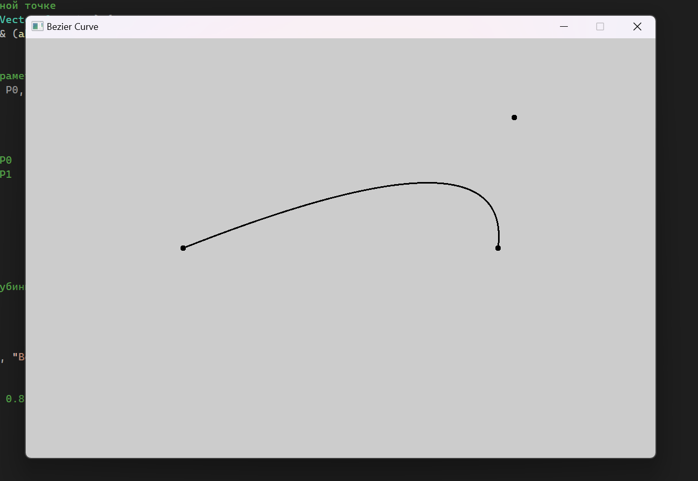
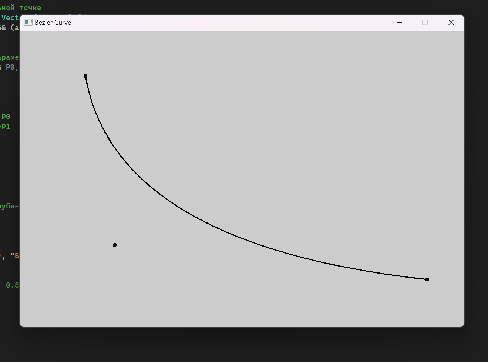
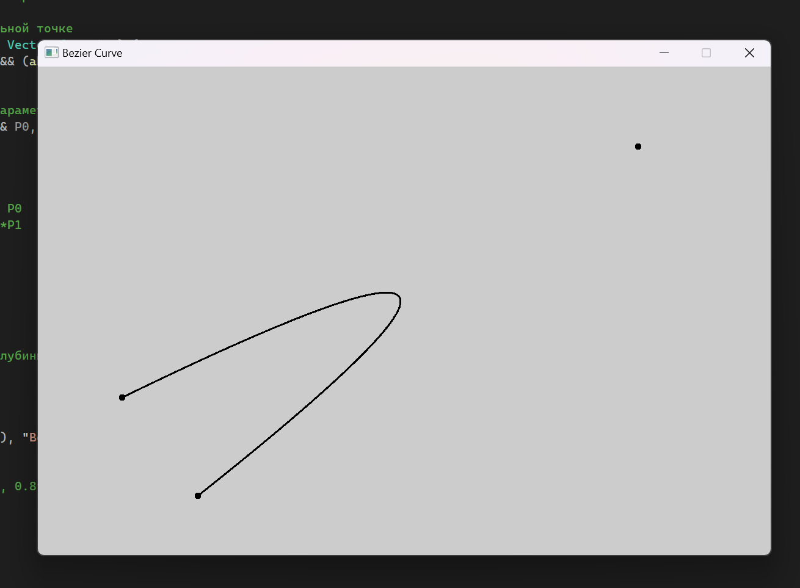

# Компьютерная графика - Лабораторная работа 1

| Студент | Группа | Вариант |
|---------|--------|---------|
| Бойцов Иван |  М8О-312Б-22 | 4 | 

## Задание

Реализуйте алгоритм построения квадратичной кривой Безье по трем контрольным точкам.
Контрольные точки должны быть видимы и управляемы пользователем через интерфейс.
Программа должна динамически обновлять кривую при перемещении контрольных точек.
Дополнительно: Реализуйте сглаживание кривой для более плавного отображения.

## Решение

### Настрока визуального окружения

Документация по фунциям OpenGL - https://docs.gl/

Для настроки визуального окружения объявим константы параметров окна и найдем его середену для отрисовки опорных точек относительно середины экрана:

```cpp
const unsigned int windowWidth = 1200;
const unsigned int windowHeight = 800;

// Центр окна
const Vector2f windowCenter(windowWidth / 2, windowHeight / 2);

// Инициализация вектора контрольных точек относительно центра окна
Vector2f controlPoints[3] = {
    Vector2f(windowCenter.x - 300.0f, windowCenter.y),   // Левая точка
    Vector2f(windowCenter.x, windowCenter.y - 200.0f),   // Верхняя точка
    Vector2f(windowCenter.x + 300.0f, windowCenter.y)    // Правая точка
};
```

В контексте установим бит глубины, равный 24. Сделаем нерасширяемое окно, для того чтобы наш проект не крашился. Цвет фона сделаем светло-серым. 

```cpp
// Настройки контекста OpenGL: 24 бита на буфер глубины
ContextSettings settings;
settings.depthBits = 24;

// Создаем окно с использованием OpenGL
Window window(VideoMode(windowWidth, windowHeight), "Bezier Curve", Style::Titlebar | Style::Close, settings);
window.setFramerateLimit(120);

// Устанавливаем светло-серый цвет фона (RGB: 0.8, 0.8, 0.8)
glClearColor(0.8f, 0.8f, 0.8f, 1.0f);
```

Настрока 2D проекции и антиалиасинга. Подробное описание действий: 

1. `glMatrixMode(GL_PROJECTION)` - Устанавливем для настройки матрицу проекции
2. `glLoadIdentity()` - Сбрасываем текущую матрицу проекции на единичную матрицу
3. `glOrtho(0, windowWidth, windowHeight, 0, -1, 1)` -Настраиваем ортографическую проекцию, в которой объекты будут отображаться без искажения (расстояние от камеры не влияет на размер объекта)
    * `(0, windowWidth)` - границы по оси X
    * `(windowHeight, 0)` - границы по оси Y
    * `(-1, -1)` - границы по оси Z
4. `glMatrixMode(GL_MODELVIEW)` - Возвращаемся к матрице модели

```cpp
// Настройка 2D проекции
glMatrixMode(GL_PROJECTION); 
glLoadIdentity(); 
glOrtho(0, windowWidth, windowHeight, 0, -1, 1);
glMatrixMode(GL_MODELVIEW); 
```

 Антиалиасинг - это сглаживание пикселной структуры на контурах при помощи добавления пикселов переходного цвета. Используем `GL_NICEST` для сглаживания с максимальным качеством. 

```cpp
// Включаем антиалиасинг линий и точек
glEnable(GL_LINE_SMOOTH);
glEnable(GL_POINT_SMOOTH);
glHint(GL_LINE_SMOOTH_HINT, GL_NICEST);
glHint(GL_POINT_SMOOTH_HINT, GL_NICEST);
```

Для реализации работы программы в режиме реального времени, а также перемещения опорных точек с использованием интерфейса программы, напишем функцию, которая сравнивает координаты курсора мыши и координаты опорной точки:

```cpp
// Функция для проверки, находится ли мышь на контрольной точке
bool isMouseOverPoint(const Vector2f& mousePos, const Vector2f& point) {
    return (abs(mousePos.x - point.x) < pointRadius) && (abs(mousePos.y - point.y) < pointRadius);
}
```

И используем эту функцию в отдельном событии программы, при этом отслеживая, что кнопка мыши нажата и кнопка - левая. Точка будет перемещаться, пока кнопка нажата и мышь двигается.

```cpp
// Если кнопка мыши нажата
if (event.type == Event::MouseButtonPressed && event.mouseButton.button == Mouse::Left)
{
    Vector2f mousePos(event.mouseButton.x, event.mouseButton.y);
    // Проверяем, попали ли мы в одну из контрольных точек
    for (int i = 0; i < 3; i++)
    {
        if (isMouseOverPoint(mousePos, controlPoints[i])) {
            selectedPoint = i;  // Запоминаем, какую точку начали двигать
            break;
        }
    }
}
// Если кнопка мыши отпущена
if (event.type == Event::MouseButtonReleased && event.mouseButton.button == Mouse::Left)
{
    selectedPoint = -1;  // Прекращаем перемещение
}

// Если мышь двигается и точка выбрана
if (event.type == Event::MouseMoved && selectedPoint != -1)
{
    controlPoints[selectedPoint] = Vector2f(event.mouseMove.x, event.mouseMove.y);
}
```

Ну и отрисуем наши точки и нашу линию используя фунции OpenGL

```cpp
// Очищаем экран
glClear(GL_COLOR_BUFFER_BIT | GL_DEPTH_BUFFER_BIT);

// Рисуем контрольные точки
glColor3f(0.0f, 0.0f, 0.0f);
glPointSize(pointRadius * 2);
glBegin(GL_POINTS);
for (int i = 0; i < 3; ++i)
{
    glVertex2f(controlPoints[i].x, controlPoints[i].y);
}
glEnd();

// Рисуем линию кривой Безье
glLineWidth(2.0f);  // Толщина линии кривой
glBegin(GL_LINE_STRIP);
for (float t = 0; t <= 1; t += 0.001f) {
    Vector2f bezierPoint = calculateBezierPoint(t, controlPoints[0], controlPoints[1], controlPoints[2]);
    glVertex2f(bezierPoint.x, bezierPoint.y);
}
glEnd();

// Меняем буферы местами для отображения следующего кадра
window.display();

```

### Решение задачи построения кривой Безье

Для выполнения данной работы необходимо понимать, что для построения кривой Безье для трех точек можно просто использовать формулу: 

$$ P = (1-t)^2 P_0 + 2(1-t)tP_1 + t^2P_2$$

где в:
$P_i$ подставляем координаты i-опорной точки $(x_i, y_i)$

Эту формулу мы реализуем в данной функции:
```cpp
// Функция для вычисления точки на кривой Безье для параметра t (по формуле для двух точек)
Vector2f calculateBezierPoint(float t, const Vector2f& P0, const Vector2f& P1, const Vector2f& P2) {
    float u = 1 - t;
    float tt = t * t;
    float uu = u * u;

    Vector2f point = uu * P0;            // (1-t)^2 * P0
    point += 2 * u * t * P1;             // 2*(1-t)*t*P1
    point += tt * P2;                    // t^2 * P2

    return point;
}
```

Для построения кривой мы оборачиваем данную функцию в цикл от 0 до 1 с дробным значением t и шагом t+=0.001f для большего сглаживания:

```cpp
for (float t = 0; t <= 1; t += 0.001f) {
    Vector2f bezierPoint = calculateBezierPoint(t, controlPoints[0], controlPoints[1], controlPoints[2]);
    glVertex2f(bezierPoint.x, bezierPoint.y);
}
```

Для регулировки сглаживания можно изменить шаг t в цикле, следующи образом: `for (float t = 0; t <= 1; t += 0.25f)`

## Результаты работы

Программа работает в режиме реального времени и отрисовывает кривую относительно положения точек. Все точки в проекте можно двигать, нажав на неё мышью.

#### Без сглаживания


#### С применением сглаживания







## Вывод

Данная лабораторная работа познакомила меня с OpenGL и SFML, позволив визуализировать решение задачи наглядно. Помимо выполнения основного задания я смог настроить окружение, написать функцию, остлеживающую положения курсора, и визуализировать кривию Безье.
