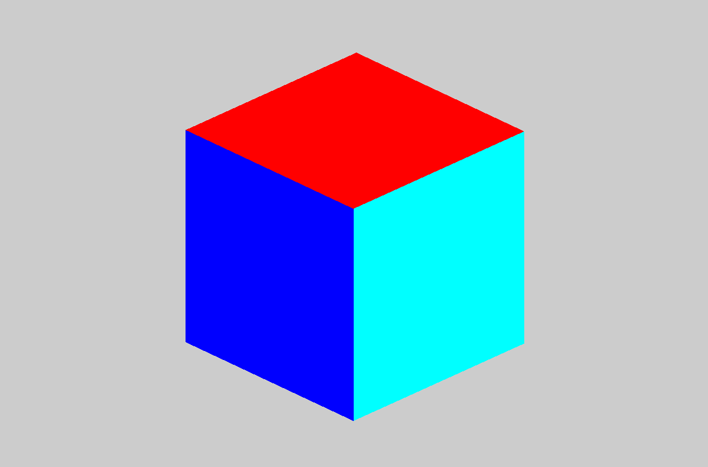
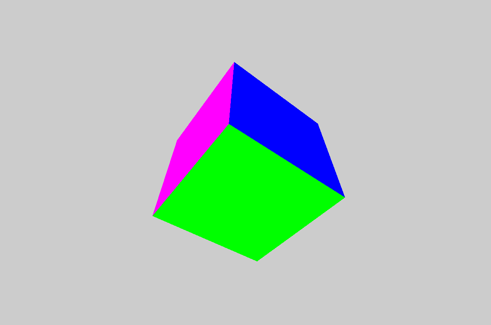

# Компьютерная графика - Лабораторная работа 2

| Студент | Группа | Вариант |
|---------|--------|---------|
| Бойцов Иван |  М8О-312Б-22 | 4 | 

## Задание

Постройте куб в 3D-пространстве.
Реализуйте переключение между ортографической и перспективной проекциями в реальном времени.
Обеспечьте плавный переход между проекциями.
Дополнительно: Добавьте возможность изменения параметров каждой проекции
(например, угол обзора для перспективной и размер проекционного объема для
ортографической).

## Решение
Используя настроенное с прошлой лабораторной окружение будем решать данную лабораторную работу.

Начнём с первого задания - построим куб, а точнее напишем функцию, которая сделает это, покрасив грани куба в разные цвета

```cpp
// Функция для отрисовки куба
void drawCube() {
    glBegin(GL_QUADS);

    // Верхняя грань (y = 1.0f)
    glColor3f(1.0f, 0.0f, 0.0f);  // Красный
    glVertex3f(-1.0f, 1.0f, -1.0f);
    glVertex3f(1.0f, 1.0f, -1.0f);
    glVertex3f(1.0f, 1.0f, 1.0f);
    glVertex3f(-1.0f, 1.0f, 1.0f);

    // Нижняя грань (y = -1.0f)
    glColor3f(0.0f, 1.0f, 0.0f);  // Зеленый
    glVertex3f(-1.0f, -1.0f, -1.0f);
    glVertex3f(1.0f, -1.0f, -1.0f);
    glVertex3f(1.0f, -1.0f, 1.0f);
    glVertex3f(-1.0f, -1.0f, 1.0f);

    // Передняя грань (z = 1.0f)
    glColor3f(0.0f, 0.0f, 1.0f);  // Синий
    glVertex3f(-1.0f, -1.0f, 1.0f);
    glVertex3f(1.0f, -1.0f, 1.0f);
    glVertex3f(1.0f, 1.0f, 1.0f);
    glVertex3f(-1.0f, 1.0f, 1.0f);

    // Задняя грань (z = -1.0f)
    glColor3f(1.0f, 1.0f, 0.0f);  // Желтый
    glVertex3f(-1.0f, -1.0f, -1.0f);
    glVertex3f(1.0f, -1.0f, -1.0f);
    glVertex3f(1.0f, 1.0f, -1.0f);
    glVertex3f(-1.0f, 1.0f, -1.0f);

    // Левая грань (x = -1.0f)
    glColor3f(1.0f, 0.0f, 1.0f);  // Фиолетовый
    glVertex3f(-1.0f, -1.0f, -1.0f);
    glVertex3f(-1.0f, -1.0f, 1.0f);
    glVertex3f(-1.0f, 1.0f, 1.0f);
    glVertex3f(-1.0f, 1.0f, -1.0f);

    // Правая грань (x = 1.0f)
    glColor3f(0.0f, 1.0f, 1.0f);  // Голубой
    glVertex3f(1.0f, -1.0f, -1.0f);
    glVertex3f(1.0f, -1.0f, 1.0f);
    glVertex3f(1.0f, 1.0f, 1.0f);
    glVertex3f(1.0f, 1.0f, -1.0f);

    glEnd();
}
```

После этого объявим переменные, которые будут использоваться в дальнейшем

```cpp
// Переменные для управления мышью
bool isDragging = false;
Vector2i lastMousePosition;
float cameraDistance = 5.0f; // Начальное расстояние до камеры
float angleX = 0.0f; // Угол вращения по X
float angleY = 0.0f; // Угол вращения по Y
float orthoScale = 1.0f; // Масштаб для ортографической проекции
```

И напишем функцию, которая настраивать ортографическую и перспективную проекцию

```cpp
// Функция для настройки проекции
void setupProjection() {
    glMatrixMode(GL_PROJECTION);
    glLoadIdentity();
    float aspect = static_cast<float>(windowWidth) / static_cast<float>(windowHeight);
    if (isPerspective) {
        // Настройки перспективной проекции
        gluPerspective(60.0f, aspect, 1.0f, 100.0f);
    }
    else {
        // Настройки ортографической проекции
        glOrtho(-aspect * orthoScale, aspect * orthoScale, -1.0f * orthoScale, 1.0f * orthoScale, 1.0f, 100.0f);
    }
    glMatrixMode(GL_MODELVIEW);
}
```

Также настроим переключение проекций по нажатию пробела

```cpp
// Обработка нажатия пробела для переключения проекций
if (event.type == Event::KeyPressed && event.key.code == Keyboard::Space) {
    isPerspective = !isPerspective;
    setupProjection();
}
```

Наконец отрисуем наш куб

```cpp
// Настройка камеры
glLoadIdentity();
// Установка для перспективной проекции
if (isPerspective) {
    gluLookAt(0.0, 0.0, cameraDistance, 0.0, 0.0, 0.0, 0.0, 1.0, 0.0);
    glRotatef(angleX, 1.0f, 0.0f, 0.0f);  // Вращение по X
    glRotatef(angleY, 0.0f, 1.0f, 0.0f);  // Вращение по Y
}
else {
    // Установка для ортографической проекции
    glTranslatef(0.0f, 0.0f, -cameraDistance); // Установка расстояния до куба
}

// Отрисовка куба
drawCube();
```

Теперь выполним дополнительное задание. Добавим возможность вращения куба с помощью движения зажатой мышки при переспективной проекции или отдаления ортографической проекции скроллом колесика мышки.

```cpp
// Обработка нажатия мыши
if (event.type == Event::MouseButtonPressed) {
    if (event.mouseButton.button == Mouse::Left) {
        isDragging = true;
        lastMousePosition = Mouse::getPosition(window);
    }
}
if (event.type == Event::MouseButtonReleased) {
    if (event.mouseButton.button == Mouse::Left) {
        isDragging = false;
    }
}
// Обработка движения мыши
if (event.type == Event::MouseMoved) {
    if (isDragging) {
        Vector2i currentMousePosition = Mouse::getPosition(window);
        int deltaX = currentMousePosition.x - lastMousePosition.x;
        int deltaY = currentMousePosition.y - lastMousePosition.y;

        // Изменение угла вращения только в перспективной проекции
        if (isPerspective) {
            angleY += deltaX * 0.5f;  // Поворот вокруг Y
            angleX += deltaY * 0.5f;  // Поворот вокруг X
        }
        lastMousePosition = currentMousePosition;
    }
}

// Обработка прокрутки колесика мыши для изменения масштаба ортографической проекции
if (event.type == Event::MouseWheelScrolled) {
    if (!isPerspective) {
        if (event.mouseWheelScroll.delta > 0) {
            orthoScale *= 0.9f; // Уменьшение масштаба (увеличение объекта)
        }
        else {
            orthoScale *= 1.1f; // Увеличение масштаба (уменьшение объекта)
        }
        setupProjection();
    }
}
```

## Результаты работы

Программа работает в режиме реального времени и отрисовывает куб в двух проекция при переключении. Первая проекция - перспективная.

### 3D проекция




## 2D проекция



## Вывод

В этой лабораторной работе я построил кубик и покрутил его. Помимо этой работе получилось поработать с отрографическим и перспективной проекцией, что позволило также прощупать openGL в 3D измерении.