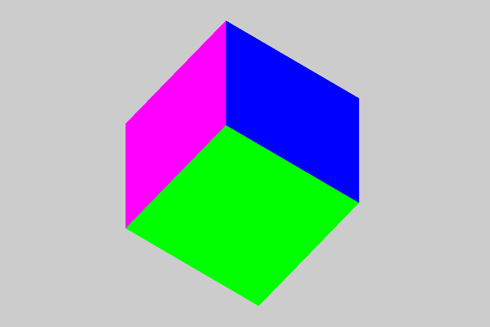

# Компьютерная графика - Лабораторная работа 2

| Студент | Группа | Вариант |
|---------|--------|---------|
| Бойцов Иван |  М8О-312Б-22 | 4 | 

## Задание

Постройте куб в 3D-пространстве.
Реализуйте переключение между ортографической и перспективной проекциями в реальном времени.
Обеспечьте плавный переход между проекциями.
Дополнительно: Добавьте возможность изменения параметров каждой проекции
(например, угол обзора для перспективной и размер проекционного объема для
ортографической).

## Решение

## Результаты работы

Программа работает в режиме реального времени и отрисовывает куб в двух проекция при переключении. Первая проекция - перспективная.

### 3D проекция

## 2D проекция

## Вывод

В этой лабораторной работе я построил кубик и покрутил его. Помимо этой работе получилось поработать с отрографическим и перспективной проекцией, что позволило также прощупать openGL в 3D измерении.