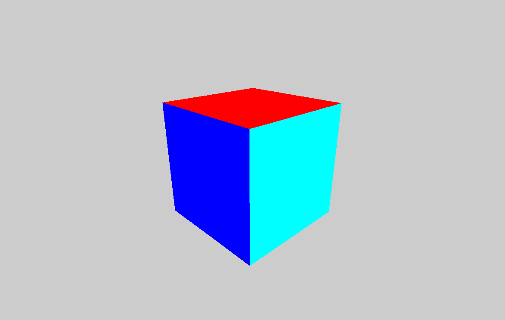
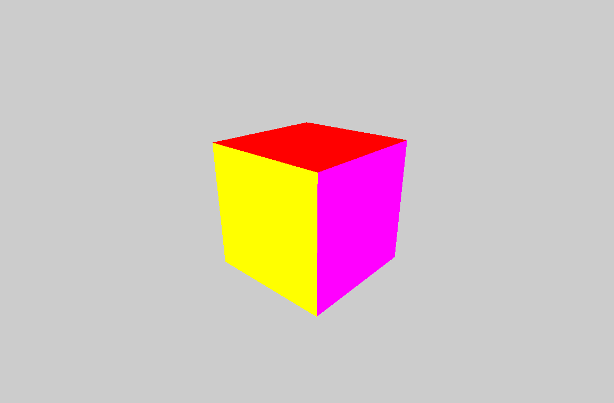
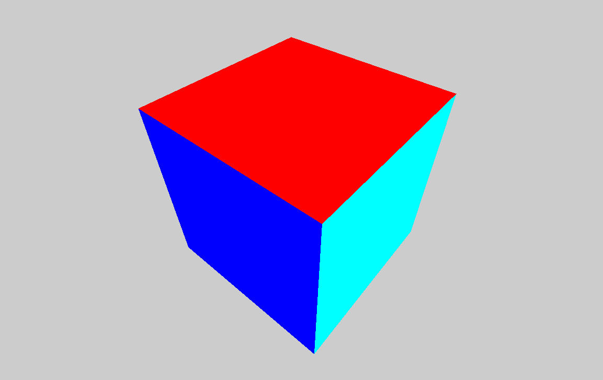
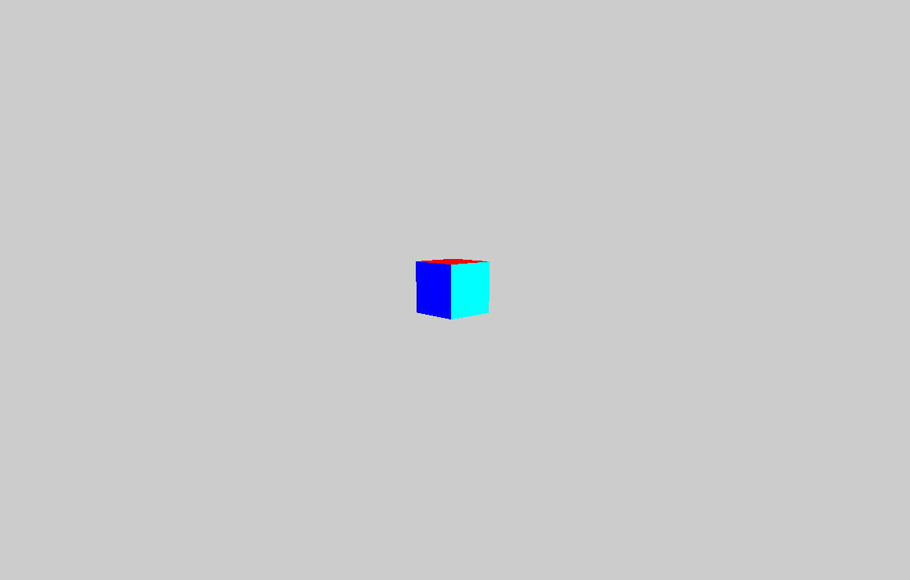
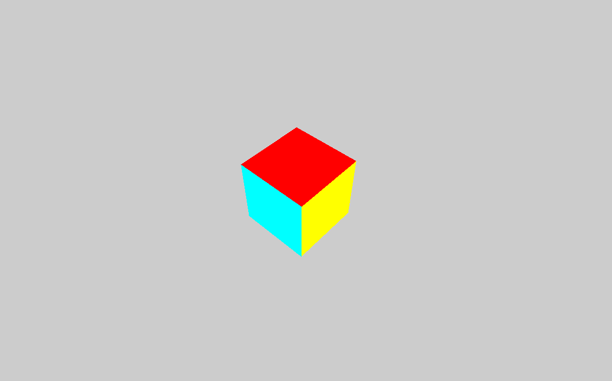

# Компьютерная графика - Лабораторная работа 2

| Студент | Группа | Вариант |
|---------|--------|---------|
| Бойцов Иван |  М8О-312Б-22 | 4 | 

## Задание

Постройте куб в 3D-пространстве.

Реализуйте камеру с использованием матрицы вида (look-at), которая всегда смотрит на куб.
Реализуйте возможность перемещения камеры по круговой траектории вокруг куба, сохраняя взгляд направленным на объект.
Дополнительно: Добавьте возможность изменения высоты камеры, чтобы наблюдать объект с разных углов.

## Решение

Так как в данной лабораторной работе нам, как и в прошлой, необходимо построить куб, то просто возьмём реализацию куба из прошлой работы.

```cpp
// Отрисовка куба
void drawCube() {
    glBegin(GL_QUADS);

    // Верхняя грань
    glColor3f(1.0f, 0.0f, 0.0f);
    glVertex3f(-1.0f, 1.0f, -1.0f);
    glVertex3f(1.0f, 1.0f, -1.0f);
    glVertex3f(1.0f, 1.0f, 1.0f);
    glVertex3f(-1.0f, 1.0f, 1.0f);

    // Нижняя грань
    glColor3f(0.0f, 1.0f, 0.0f);
    glVertex3f(-1.0f, -1.0f, -1.0f);
    glVertex3f(1.0f, -1.0f, -1.0f);
    glVertex3f(1.0f, -1.0f, 1.0f);
    glVertex3f(-1.0f, -1.0f, 1.0f);

    // Передняя грань
    glColor3f(0.0f, 0.0f, 1.0f);
    glVertex3f(-1.0f, -1.0f, 1.0f);
    glVertex3f(1.0f, -1.0f, 1.0f);
    glVertex3f(1.0f, 1.0f, 1.0f);
    glVertex3f(-1.0f, 1.0f, 1.0f);

    // Задняя грань
    glColor3f(1.0f, 1.0f, 0.0f);
    glVertex3f(-1.0f, -1.0f, -1.0f);
    glVertex3f(1.0f, -1.0f, -1.0f);
    glVertex3f(1.0f, 1.0f, -1.0f);
    glVertex3f(-1.0f, 1.0f, -1.0f);

    // Левая грань
    glColor3f(1.0f, 0.0f, 1.0f);
    glVertex3f(-1.0f, -1.0f, -1.0f);
    glVertex3f(-1.0f, -1.0f, 1.0f);
    glVertex3f(-1.0f, 1.0f, 1.0f);
    glVertex3f(-1.0f, 1.0f, -1.0f);

    // Правая грань
    glColor3f(0.0f, 1.0f, 1.0f);
    glVertex3f(1.0f, -1.0f, -1.0f);
    glVertex3f(1.0f, 1.0f, -1.0f);
    glVertex3f(1.0f, 1.0f, 1.0f);
    glVertex3f(1.0f, -1.0f, 1.0f);

    glEnd();
}
```
В данной лабораторной работе нам необходимо сделать и настроить камеру. Её, как и необходимо по заданию, мы реализуем с помощью `gluLookAt` матрицы, а также объявим некоторые переменные для настройки положения камеры.

```cpp
// Переменные для управления камерой
float cameraDistance = 5.0f; // Расстояние от камеры до центра сцены
float angleAroundCube = 0.0f; // Угол вращения камеры вокруг куба
float angleX = 20.0f; // Угол по оси X (для наклона камеры)
float cameraHeight = 2.0f; // Высота камеры

// Обновление матрицы вида камеры
void updateCamera() {
    glLoadIdentity();

    float cameraX = cameraDistance * cosf(angleAroundCube * M_PI / 180.0f) * cosf(angleX * M_PI / 180.0f);
    float cameraZ = cameraDistance * sinf(angleAroundCube * M_PI / 180.0f) * cosf(angleX * M_PI / 180.0f);
    float cameraY = cameraHeight;

    // Камера смотрит на центр сцены (0, 0, 0)
    gluLookAt(cameraX, cameraY, cameraZ, 0.0f, 0.0f, 0.0f, 0.0f, 1.0f, 0.0f);
}
```
Данную функцию мы будем использовать в основном цикле программы для изменения положения камеры относительно положения курсора мышки. А именно при условии, что одна из клавиш мышки нажата и двигается - изменяется и значение переменных, передаваемых в функцию `updateCamera`.

```cpp
if (event.type == Event::MouseButtonPressed) {
    if (event.mouseButton.button == Mouse::Left) {
        isLeftDragging = true;
        lastMousePosition = Mouse::getPosition(window);
    }
    else if (event.mouseButton.button == Mouse::Right) {
        isRightDragging = true;
        lastMousePosition = Mouse::getPosition(window);
    }
}

if (event.type == Event::MouseButtonReleased) {
    if (event.mouseButton.button == Mouse::Left) {
        isLeftDragging = false;
    }
    else if (event.mouseButton.button == Mouse::Right) {
        isRightDragging = false;
    }
}

if (event.type == Event::MouseMoved) {
    if (isLeftDragging) {
        Vector2i currentMousePosition = Mouse::getPosition(window);
        angleAroundCube += (currentMousePosition.x - lastMousePosition.x) * 0.5f;
        lastMousePosition = currentMousePosition;
    }
    else if (isRightDragging) {
        Vector2i currentMousePosition = Mouse::getPosition(window);
        float deltaY = currentMousePosition.y - lastMousePosition.y;
        cameraHeight += deltaY * 0.1f; // Регулируем высоту камеры
        lastMousePosition = currentMousePosition;
    }
}

if (event.type == Event::MouseWheelScrolled) {
    cameraDistance += event.mouseWheelScroll.delta * 0.2f; // Регулировка расстояния
}

```

## Результаты работы

Программа работает в режиме реального времени и позволяет управлять камерой, направленной на куб, с помощью кнопок мыши. А именно:
* Левая кнопка мыши позволяет изменять положение камеры относительно куба;
* Правая кнопка мыши изменяет масштаб;
* Скрол мыши также изменяет приближение;

### Изменение положения

 



### Приближение





### Высота




## Вывод

Данная лабораторная работа очень похожа на предыдущую, поэтому не составила больших трудностей. В ней мне удалось немного детальнее поработать с камерой, а именно настроить её на изменение высоты и приближения.